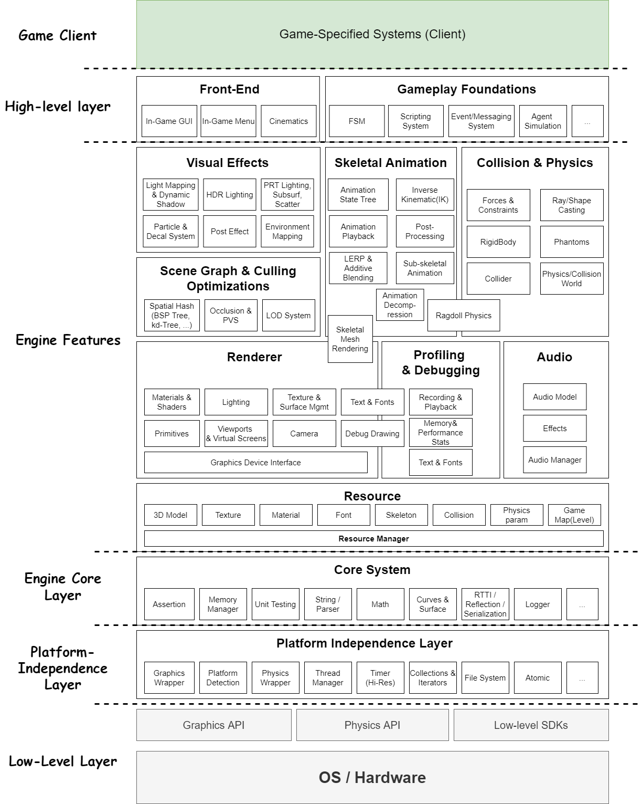

# 20220410 회의록

#### 회의 참여자

* 임용식
* 조별희

## 1. 코딩 스타일

[프로젝트 Wiki 참고합시다](https://github.com/Hamsik2rang/Kepler/wiki/Code-Convention)

## 2. 브랜칭 & 풀리퀘스트 소개

* 작업을 할 땐 작업 단위로 브랜치를 따서(생성해서) 작업합니다.

* 한 브랜치 안에서 작업하다가도 또 뭔가 새로운 이슈가 생기면 그 안에서도 새로운 브랜치를 따서 작업합니다. 

  브랜치는 가능한 세밀한 단위로 잘라서 작업해야 작업 효율이 좋습니다(웬만하면?)

* 한 브랜치 안에서 작업이 끝났을 때, 해당 작업을 메인 브랜치 또는 자신이 생성하지 않은 브랜치에 병합하려는 경우 풀 리퀘스트를 통해 다른 개발자(들)에게 코드 리뷰를 받습니다.

* 리뷰를 통해 merge 가능하다는 결론에 도달하면 그 때 브랜치를 병합하며, 브랜치 병합은 리뷰를 한 다른 개발자들이 병합합니다. **(자신이 직접 하지 않습니다!)**

## 3. 아키텍처 설명 & 작업 분배

[프로젝트 Documents 폴더의 이미지 참고합시다](https://github.com/Hamsik2rang/Kepler/tree/main/Documents)

* **중요! 아키텍처 상에서 임의의 레이어는 절대 자기보다 상위 레이어에 의존성을 가지면 안됨(Linear Dependence X)**
* 일단 임용식 혼자 작업 좀 하다가 5월에 중간고사 끝나면 다시 회의해서 작업 분배할 예정

## 4. Issue & Project

* 해야 할 작업은 작업 단위로 이슈를 생성합니다.
* 생성된 이슈는 Project->Work Stack의 **`To do`** 리스트에 자동으로 쌓입니다(Stacked)
* 본인이 할 작업을 **`In-Progress`** 리스트에 옮기고 작업을 시작한 후, 작업이 완료되고 테스트 단계에 돌입하면 **`Test`** 탭으로 이동시킵니다
* 테스트도 성공적으로 통과하고 Pull Request를 통해 코드리뷰까지 다 끝나면(Merge가 되면) **`Done`** 탭으로 이동시킵니다

## 5. 코드리뷰

* 중간고사 끝나면 코드리뷰 합시다~
